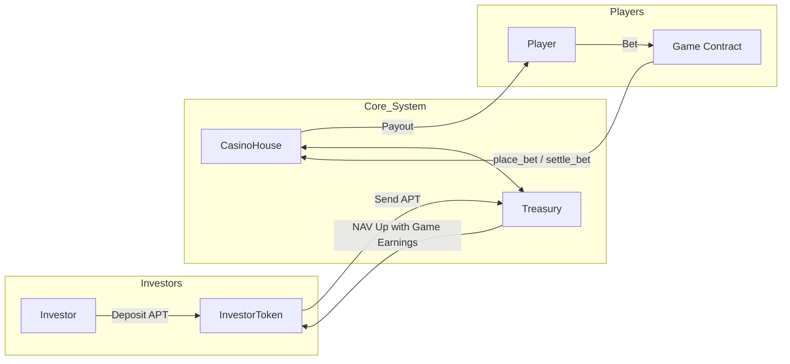

# 🎰 ChainCasino

> **"The first on-chain casino protocol where a token-backed treasury powers multiple games, and investors earn real yield through rising NAV as the house wins."**

ChainCasino is a decentralized protocol on **Aptos** that merges casino gaming with DeFi investing.

- 💰 **Investor Token (CCIT):** NAV-based token that tracks a growing treasury
- 🎲 **Modular Games:** Games are external smart contracts with access granted via capabilities
- 🏦 **On-Chain Treasury:** Treasury handles all bets and redemptions transparently
- 🔐 **Security First:** Built in Move 2 on Aptos

---

ChainCasino turns **"The House Always Wins"** into **"The Investor Always Earns."**

---

## 📐 Architecture Overview

---

## 🚀 Key Concepts

- **NAV-Based Tokenomics**  
  Minting and redemption adjust token supply to keep NAV constant for others.  
  Treasury grows → NAV increases → CCIT is worth more.

- **Modular Game Authorization**  
  Games are **independent contracts**. Casino only grants treasury access using `GameCapability`.  
  Anyone can write games, no central control.

- **On-Chain Fairness**  
  Aptos randomness is used in all games. Events log all rolls, spins, and payouts.

---

## 🔬 Move 2 Feature Explorations

- `fungible-assets` - Modern FA standard implementation
- `randomness` - Randomness patterns  
- `object-composability` - Object relationships & inheritance

---

## 🔧 Modules

### `CasinoHouse.move`
- Treasury manager
- Game registry and capability issuer
- Bet placement and settlement logic

### `InvestorToken.move`
- CCIT minting/redeeming
- NAV tracking
- Redemption fee logic

### `DiceGame.move` & `SlotMachine.move`
- Example modular games
- Use randomness for outcome
- Call CasinoHouse to settle bets

---

## 📦 How to Use

1. Deploy modules: `CasinoHouse`, `InvestorToken`, and any game
2. Call `InvestorToken::deposit_and_mint()` to fund the treasury and mint CCIT
3. Casino grant capabilities to call `CasinoHouse::place_bet()` `CasinoHouse::settle_bet()` `CasinoHouse::get_game_capability()` to games smart contracts
4. Games place bets using `CasinoHouse::place_bet()`
5. Settle outcomes using `CasinoHouse::settle_bet()`
6. Investors redeem using `InvestorToken::redeem()`

---

## 📊 House Edge Example (DiceGame)

- Player chooses number 1–6  
- Wins if guess is correct  
- Payout: 5x  
- House Edge: ~16.67%  
- Treasury absorbs losses → NAV grows

---

## TODO

- Add Previous Branch Tests Refactor Made Obsolete

---

## 🧠 Future Ideas

- DAO for treasury governance
- More games

---

ChainCasino turns **"The House Always Wins"** into **"The Investor Always Earns."**

---

MIT License