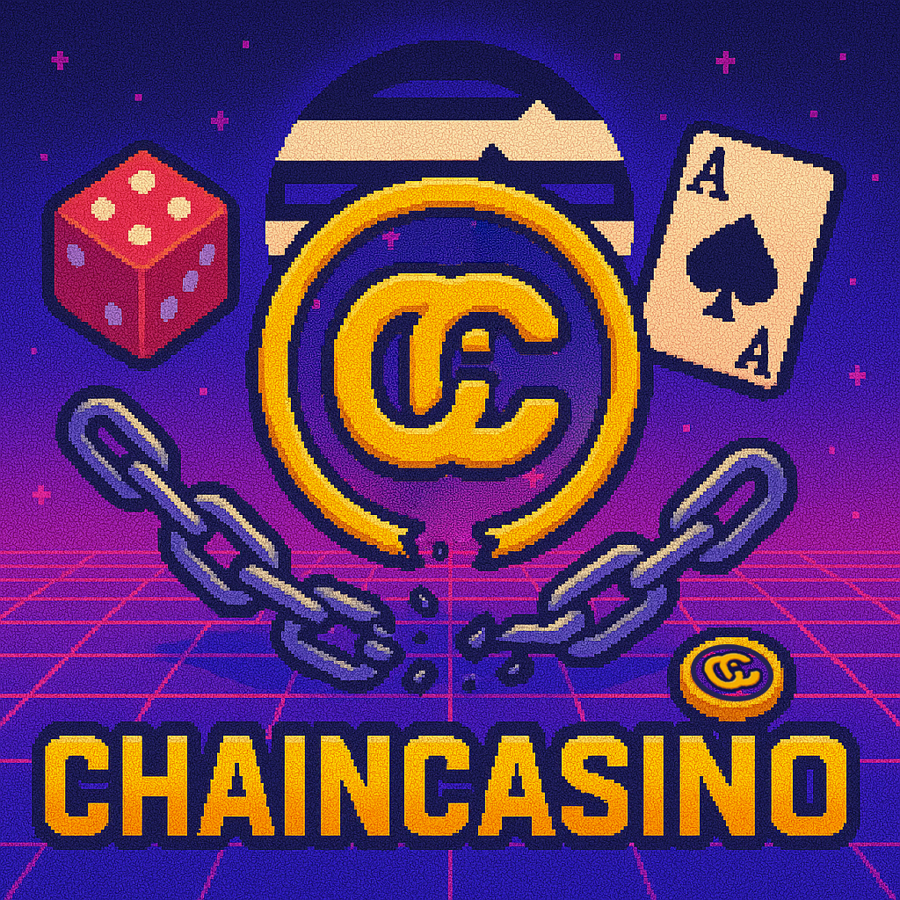
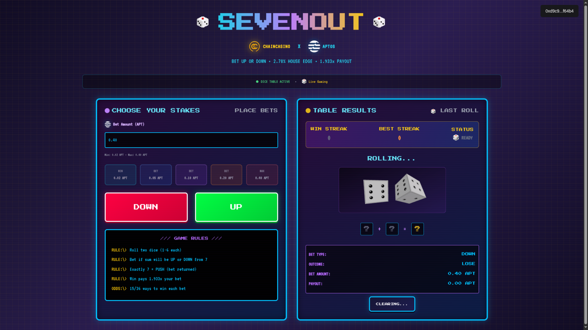

# ChainCasino

> **Composable, modular on-chain casino where token holders act as the house, earning yield through verifiable statistical advantage, with support for independent games, DeFi pool integration, and endless third-party extensions.**

## 🎯 Project Overview

ChainCasino demonstrates a fundamentally new financial product architecture: NAV-based fungible assets backed by autonomous treasury systems that aggregate and redistribute cash flows from any revenue-generating activity.

The core innovation is the ChainCasino Investor Token (CCIT) - a programmable financial instrument that automatically appreciates as underlying treasuries grow from multiple revenue streams. While gaming serves as the first implementation, this same treasury-token architecture can be applied to insurance risk pools, real estate, content platforms, SaaS businesses, or any economic activity.

Instead of traditional dividend distributions or staking rewards, investors benefit through real-time token value appreciation calculated from aggregated treasury performance. As revenue sources generate profits across the ecosystem, treasury balances increase, directly raising the NAV per token for all holders.

This creates a new asset class: liquid ownership stakes in diversified revenue streams with instant redemption and transparent, algorithmic value calculation - impossible in traditional finance but enabled by Aptos blockchain's speed and Move 2's security guarantees.

## 🏗️ Technical Implementation

ChainCasino is a decentralized casino protocol on **Aptos** that merges casino gaming with DeFi investing through a sophisticated treasury management system.

- 💰 **Investor Token (CCIT):** NAV-based fungible asset that appreciates as treasury grows
- 🏦 **Dynamic Treasury:** Automated routing between central and game treasuries
- 🎲 **Composable & Modular Games:** Independent smart contracts that plug-and-play into the casino ecosystem via capability-based authorization  
- 🔐 **Security First:** Built with Move 2's security guarantees and Aptos randomness

---

ChainCasino turns **"The House Always Wins"** into **"The Investor Always Earns."**



---

## 🎮 Platform Overview

### Investor Portal
Complete dashboard for CCIT token management and portfolio tracking - the core investment platform.


### Game Hub
The central hub where players discover and access all registered games.


---

## 📐 Architecture Overview

### Core System Flow

```mermaid
flowchart TD
    subgraph "💰 Investment Layer"
        Investor[👤 Investor]
        CCIT[🪙 CCIT Token<br/>NAV-based FA]
    end

    subgraph "🏛️ Casino Core"
        Casino[🏠 CasinoHouse<br/>• Game Registry<br/>• Treasury Router<br/>• Auto-Rebalancing]
    end

    subgraph "🎮 Game Modules"
        DiceGame[🎲 DiceGame<br/>16.67% house edge]
        SlotGame[🎰 SlotMachine<br/>15.5% house edge]
    end

    subgraph "💳 Treasury System"
        Central[🏦 Central Treasury<br/>• Investor deposits<br/>• Large payouts]
        DiceTreasury[💎 Dice Treasury<br/>• Hot funds<br/>• Auto-rebalancing]
        SlotTreasury[🎰 Slot Treasury<br/>• Hot funds<br/>• Auto-rebalancing]
    end

    subgraph "👥 Players"
        Player1[👤 Player A]
        Player2[👤 Player B]
    end

    %% Investment Flow
    Investor -->|deposit_and_mint<br/>APT → CCIT| CCIT
    CCIT -->|All deposits| Central
    CCIT <-->|redeem<br/>CCIT ↔ APT| Investor

    %% Player Gaming Flow
    Player1 -->|play_dice| DiceGame
    Player2 -->|spin_slots| SlotGame

    %% Bet Processing Flow
    DiceGame -->|place_bet via capability| Casino
    SlotGame -->|place_bet via capability| Casino

    %% Treasury Routing Logic
    Casino -->|Normal operation| DiceTreasury
    Casino -->|Normal operation| SlotTreasury
    Casino -->|Large payouts| Central

    %% Rebalancing Flow
    Central -->|Drain protection| DiceTreasury
    Central -->|Drain protection| SlotTreasury
    DiceTreasury -->|Overflow protection| Central
    SlotTreasury -->|Overflow protection| Central
```



### Treasury Architecture & Auto-Rebalancing

```mermaid
flowchart TD
    subgraph "🏦 Treasury Ecosystem"
        subgraph "Central Treasury"
            Central[💰 Central Treasury<br/>• Large payouts when &gt; game balance<br/>• Liquidity provider<br/>• Investor redemptions]
        end
        
        subgraph "Game Treasury A"
            DiceStore[🎲 Dice Hot Store<br/>FA Primary Store]
            DiceConfig[📊 Dice Config<br/>• Target: 7-day volume × 1.5<br/>• Overflow: Target × 110%<br/>• Drain: Target × 25%<br/>• Rolling Volume Tracking]
            DiceStore --- DiceConfig
        end
        
        subgraph "Game Treasury B"
            SlotStore[🎰 Slot Hot Store<br/>FA Primary Store]
            SlotConfig[📊 Slot Config<br/>• Target: 7-day volume × 1.5<br/>• Overflow: Target × 110%<br/>• Drain: Target × 25%<br/>• Rolling Volume Tracking]
            SlotStore --- SlotConfig
        end
    end

    subgraph "🔄 Auto-Rebalancing Logic"
        Overflow[💹 Overflow Trigger<br/>When balance > 110% target<br/>→ Send 10% excess to Central]
        
        Drain[⚠️ Drain Trigger<br/>When balance < 25% target<br/>→ Request funds from Central]
        
        Volume[📈 Volume Updates<br/>Each bet updates:<br/>rolling_volume = old×6 + new×1.5 ÷ 7<br/>→ Recalculates all thresholds]
    end

    %% Rebalancing Flows
    DiceStore -.->|"Balance > Overflow"| Overflow
    SlotStore -.->|"Balance > Overflow"| Overflow
    Overflow -->|"Transfer excess"| Central
    
    Central -->|"Inject liquidity"| Drain
    Drain -.->|"Balance < Drain"| DiceStore
    Drain -.->|"Balance < Drain"| SlotStore
    
    DiceStore --> Volume
    SlotStore --> Volume
    Volume --> DiceConfig
    Volume --> SlotConfig

    classDef central fill:#e8f5e8,stroke:#2e7d32,stroke-width:2px
    classDef game fill:#fff3e0,stroke:#e65100,stroke-width:2px
    classDef logic fill:#e1f5fe,stroke:#01579b,stroke-width:2px
    
    class Central central
    class DiceStore,SlotStore,DiceConfig,SlotConfig game
    class Overflow,Drain,Volume logic
```



### Block-STM Parallel Execution

```mermaid
flowchart TD
    subgraph "💰 Investment Layer"
        Investor[👤 Investor]
        CCIT[🪙 CCIT Token<br/>NAV-based FA]
    end

    subgraph "🏛️ Casino Core"
        Casino[🏠 CasinoHouse<br/>• Game Registry<br/>• Treasury Router<br/>• Auto-Rebalancing<br/>• Capability Management]
    end

    subgraph "🎮 Game Ecosystem"
        SevenOut[🎲 SevenOut<br/>• Two-dice Over/Under 7<br/>• 1.933x Payout]
        RouletteGame[🎯 AptosRoulette<br/>• European Roulette<br/>• Multiple Bet Types]
        FortuneGame[🎰 AptosFortune<br/>• Premium Slot Machine<br/>• Partial Match Payouts]
    end

    subgraph "💳 Treasury Isolation"
        Central[🏦 Central Treasury<br/>• Investor Funds<br/>• Large Payouts<br/>• Liquidity Provider]
        SevenOutTreasury[💎 SevenOut Treasury<br/>@unique_address_1]
        RouletteTreasury[🎯 Roulette Treasury<br/>@unique_address_2]
        FortuneTreasury[🎰 Fortune Treasury<br/>@unique_address_3]
    end

    %% Investment Flow
    Investor -->|deposit_and_mint| CCIT
    CCIT -->|Funds Central Treasury| Central
    CCIT <-->|redeem at current NAV| Investor

    %% Game Operation Flow
    Casino -->|Route based on balance| SevenOutTreasury
    Casino -->|Route based on balance| RouletteTreasury
    Casino -->|Route based on balance| FortuneTreasury

    %% Auto-Rebalancing
    SevenOutTreasury -.->|Excess → Central| Central
    RouletteTreasury -.->|Excess → Central| Central
    FortuneTreasury -.->|Excess → Central| Central
    Central -.->|Liquidity Injection| SevenOutTreasury
    Central -.->|Liquidity Injection| RouletteTreasury
    Central -.->|Liquidity Injection| FortuneTreasury

    %% NAV Calculation
    Central -->|Balance Aggregation| CCIT
    SevenOutTreasury -->|Balance Aggregation| CCIT
    RouletteTreasury -->|Balance Aggregation| CCIT
    FortuneTreasury -->|Balance Aggregation| CCIT

    classDef investment fill:#e1f5fe,stroke:#01579b,stroke-width:2px
    classDef casino fill:#f3e5f5,stroke:#4a148c,stroke-width:2px
    classDef game fill:#fff3e0,stroke:#e65100,stroke-width:2px
    classDef treasury fill:#e8f5e8,stroke:#1b5e20,stroke-width:2px

    class Investor,CCIT investment
    class Casino casino
    class SevenOut,RouletteGame,FortuneGame game
    class Central,SevenOutTreasury,RouletteTreasury,FortuneTreasury treasury
```



### Treasury Auto-Rebalancing System

The protocol implements sophisticated treasury management with automatic rebalancing based on rolling volume calculations and configurable thresholds.

**Key Metrics:**
- **Target Reserve:** 7-day rolling volume × 1.5
- **Overflow Threshold:** Target × 110% (triggers excess transfer to central)
- **Drain Threshold:** Target × 25% (triggers liquidity injection from central)

**Key Insights:** 
- Different treasury addresses = No resource conflicts = True parallel execution
- Dynamic rebalancing maintains optimal liquidity distribution
- Rolling volume calculation adapts to actual game activity

---

## 🏗️ System Components

### 1. CasinoHouse (Core Registry & Treasury Management)
The central coordination module that manages game registration through a capability-based authorization system. Features dynamic treasury routing between central and game treasuries with automatic rebalancing based on volume and liquidity thresholds.

### 2. InvestorToken (CCIT Fungible Asset)
NAV-based token system where investors earn yield through treasury growth. Implements proportional minting/burning with 0.1% redemption fees. Real-time NAV calculation aggregates all treasury balances across the entire system.

### 3. Game Modules
- **SevenOut**: Two-dice Over/Under 7 game with 1.933x payout and 2.78% house edge
- **AptosRoulette**: European roulette with comprehensive betting options and 2.70% house edge
- **AptosFortune**: Premium slot machine with partial match payouts and 22% house edge

### 4. External Game Support
Modular architecture enables external developers to create games in separate packages while maintaining shared treasury access through capability-based authorization.

### 5. Frontend Application
Complete React-based user interface with:
- InvestorPortal for CCIT token management
- GameHub for game discovery
- Individual game interfaces
- Real-time portfolio tracking
- Wallet integration

---

## 💻 Technology Stack

### Blockchain Layer
- **Move 2** - Smart contract language with enhanced security features
- **Aptos Blockchain** - High-performance Layer 1 with Block-STM parallel execution
- **Aptos Randomness** - Secure on-chain randomness for games
- **Aptos SDK** - TypeScript integration for blockchain interactions

### Frontend Stack
- **React 18** - Modern UI library with hooks and concurrent features
- **TypeScript** - Type-safe development and enhanced developer experience
- **Vite** - Lightning-fast build tool and development server
- **Tailwind CSS** - Utility-first CSS framework for rapid styling

### Wallet Integration
- **Aptos Wallet Adapter** - Multi-wallet support (Petra, Martian, Pontem)
- **Wallet Connect** - Cross-platform wallet connection protocol

### Deployment & Infrastructure
- **Nginx** - Web server and reverse proxy
- **Aptos CLI** - Smart contract deployment and management
- **Docker** - Containerization for consistent deployments

---

## 🔧 Technical Implementation

### Security Model
- **Capability-based authorization**: Unforgeable game registration tokens
- **Randomness security**: Production functions use `#[randomness]` with `entry` visibility
- **Resource safety**: Explicit handling of all fungible assets and coins
- **Linear type system**: Prevents resource duplication and ensures proper lifecycle management

### Performance Optimizations
- **Block-STM compatibility**: Isolated resource addresses enable true parallel execution
- **Gas efficiency**: Pre-computed constants and optimized data structures
- **Treasury isolation**: Distributed architecture scales with number of active games

### Error Handling
- **Comprehensive error codes**: Detailed abort codes for all failure scenarios
- **Graceful degradation**: System continues operation despite individual game failures
- **Financial safety**: Treasury validation prevents over-commitment of funds

---

## 🔧 Module Structure

```
sources/
├── casino/
│   ├── casino_house.move       # Core registry and treasury management
│   └── investor_token.move     # CCIT fungible asset implementation
└── games/
    ├── dice.move               # [TEST ONLY] Reference dice implementation
    ├── slot.move               # [TEST ONLY] Reference slot implementation
    └── always_lose_game.move   # [TEST ONLY] Treasury drain testing

game-contracts/
├── SevenOut/                   # Two-dice Over/Under 7 game
│   ├── sources/seven_out.move
│   └── tests/seven_out_tests.move
├── AptosRoulette/              # European roulette implementation
│   ├── sources/aptos_roulette.move
│   └── tests/roulette_integration_tests.move
└── AptosFortune/               # Premium slot machine
    ├── sources/aptos_fortune.move
    └── tests/aptos_fortune_tests.move

frontend/
└── ccit-investor-portal/       # React frontend application
    ├── frontend/
    │   ├── components/games/   # Individual game UIs
    │   ├── pages/              # Main portal pages
    │   └── App.tsx
    ├── package.json
    └── vite.config.ts
```

---

---

## 📊 Economics

### House Edge & Returns
- **SevenOut**: 2.78% house edge (Over/Under 7 with 1.933x payout)
- **AptosRoulette**: 2.70% house edge (European single-zero roulette)
- **AptosFortune**: 22% house edge (frequent wins with partial matches)
- **Investor Returns**: CCIT appreciates through NAV growth as treasury accumulates profits

### Treasury Mechanics
- **NAV Calculation**: `NAV = Total Treasury Balance / Total Token Supply`
- **Minting**: New tokens issued at current NAV
- **Redemption**: Tokens burned at current NAV (0.1% fee)
- **Auto-Rebalancing**: Maintains optimal liquidity distribution

---

## 🖥️ Frontend Development

### Components

#### InvestorPortal
Main dashboard for CCIT management with real-time portfolio tracking and treasury insights.


#### GameHub
Game discovery and navigation interface showing all available games and their statistics.


#### SevenOut
Two-dice Over/Under 7 game with simple betting interface and real-time results.



#### AptosRoulette
European roulette with comprehensive betting options and animated wheel.


#### AptosFortune
Premium slot machine with partial match payouts and detailed payout table.


---

## 🧪 Testing

The codebase includes comprehensive testing at multiple levels:

- **Unit Tests**: Module-specific functionality
- **Integration Tests**: Cross-module interactions
- **End-to-End Tests**: Complete user journeys
- **Treasury Mechanics**: Rebalancing and liquidity management

```bash
# Run all tests
aptos move test

# Run specific test categories
aptos move test --filter integration
aptos move test --filter end_to_end
```

---

## 📄 License

MIT License - see LICENSE file for details.

---

*Built with Move 2 on Aptos Blockchain*
