# 🎰 ChainCasino

> **"The first on-chain casino protocol where a token-backed treasury powers multiple games, and investors earn real yield through rising NAV as the house wins."**

ChainCasino is a decentralized casino protocol on **Aptos** that merges casino gaming with DeFi investing through a sophisticated treasury management system.

- 💰 **Investor Token (CCIT):** NAV-based fungible asset that appreciates as treasury grows
- 🎲 **Modular Games:** Independent smart contracts with capability-based authorization
- 🏦 **Dynamic Treasury:** Automated routing between central and game treasuries
- 🔐 **Security First:** Built with Move 2's security guarantees and Aptos randomness

---

ChainCasino turns **"The House Always Wins"** into **"The Investor Always Earns."**

---

## 🚀 Quick Start

```bash
# Compile and test
aptos move compile
aptos move test

# Deploy to testnet
aptos move publish --named-addresses casino=<YOUR_ADDRESS>
```

---

## 📐 Architecture Overview

### Core System Flow

```mermaid
flowchart TD
    subgraph "💰 Investment Layer"
        Investor[👤 Investor]
        CCIT[🪙 CCIT Token<br/>NAV-based FA]
    end

    subgraph "🏛️ Casino Core"
        Casino[🏠 CasinoHouse<br/>• Game Registry<br/>• Treasury Router<br/>• Auto-Rebalancing]
    end

    subgraph "🎮 Game Modules"
        DiceGame[🎲 DiceGame<br/>16.67% house edge]
        SlotGame[🎰 SlotMachine<br/>15.5% house edge]
    end

    subgraph "💳 Treasury System"
        Central[🏦 Central Treasury<br/>• Investor deposits<br/>• Large payouts]
        DiceTreasury[💎 Dice Treasury<br/>• Hot funds<br/>• Auto-rebalancing]
        SlotTreasury[🎰 Slot Treasury<br/>• Hot funds<br/>• Auto-rebalancing]
    end

    subgraph "👥 Players"
        Player1[👤 Player A]
        Player2[👤 Player B]
    end

    %% Investment Flow
    Investor -->|deposit_and_mint<br/>APT → CCIT| CCIT
    CCIT -->|All deposits| Central
    CCIT <-->|redeem<br/>CCIT ↔ APT| Investor

    %% Player Gaming Flow
    Player1 -->|play_dice| DiceGame
    Player2 -->|spin_slots| SlotGame

    %% Bet Processing Flow
    DiceGame -->|place_bet via capability| Casino
    SlotGame -->|place_bet via capability| Casino

    %% Treasury Routing Logic
    Casino -->|Normal operation| DiceTreasury
    Casino -->|Normal operation| SlotTreasury
    Casino -->|Large payouts| Central

    %% Rebalancing Flow
    Central -->|Drain protection| DiceTreasury
    Central -->|Drain protection| SlotTreasury
    DiceTreasury -->|Overflow protection| Central
    SlotTreasury -->|Overflow protection| Central
```



### Treasury Architecture & Auto-Rebalancing

```mermaid
flowchart TD
    subgraph "🏦 Treasury Ecosystem"
        subgraph "Central Treasury"
            Central[💰 Central Treasury<br/>• Large payouts when &gt; game balance<br/>• Liquidity provider<br/>• Investor redemptions]
        end
        
        subgraph "Game Treasury A"
            DiceStore[🎲 Dice Hot Store<br/>FA Primary Store]
            DiceConfig[📊 Dice Config<br/>• Target: 7-day volume × 1.5<br/>• Overflow: Target × 110%<br/>• Drain: Target × 25%<br/>• Rolling Volume Tracking]
            DiceStore --- DiceConfig
        end
        
        subgraph "Game Treasury B"
            SlotStore[🎰 Slot Hot Store<br/>FA Primary Store]
            SlotConfig[📊 Slot Config<br/>• Target: 7-day volume × 1.5<br/>• Overflow: Target × 110%<br/>• Drain: Target × 25%<br/>• Rolling Volume Tracking]
            SlotStore --- SlotConfig
        end
    end

    subgraph "🔄 Auto-Rebalancing Logic"
        Overflow[💹 Overflow Trigger<br/>When balance > 110% target<br/>→ Send 10% excess to Central]
        
        Drain[⚠️ Drain Trigger<br/>When balance < 25% target<br/>→ Request funds from Central]
        
        Volume[📈 Volume Updates<br/>Each bet updates:<br/>rolling_volume = old×6 + new×1.5 ÷ 7<br/>→ Recalculates all thresholds]
    end

    %% Rebalancing Flows
    DiceStore -.->|"Balance > Overflow"| Overflow
    SlotStore -.->|"Balance > Overflow"| Overflow
    Overflow -->|"Transfer excess"| Central
    
    Central -->|"Inject liquidity"| Drain
    Drain -.->|"Balance < Drain"| DiceStore
    Drain -.->|"Balance < Drain"| SlotStore
    
    DiceStore --> Volume
    SlotStore --> Volume
    Volume --> DiceConfig
    Volume --> SlotConfig

    classDef central fill:#e8f5e8,stroke:#2e7d32,stroke-width:2px
    classDef game fill:#fff3e0,stroke:#e65100,stroke-width:2px
    classDef logic fill:#e1f5fe,stroke:#01579b,stroke-width:2px
    
    class Central central
    class DiceStore,SlotStore,DiceConfig,SlotConfig game
    class Overflow,Drain,Volume logic
```



### Block-STM Parallel Execution

```mermaid
flowchart TD
    subgraph "💰 Investment Layer"
        Investor[👤 Investor]
        CCIT[🪙 CCIT Token<br/>NAV-based FA]
    end

    subgraph "🏛️ Casino Core"
        Casino[🏠 CasinoHouse<br/>• Game Registry<br/>• Treasury Router<br/>• Auto-Rebalancing<br/>• Capability Management]
    end

    subgraph "🎮 Game Ecosystem"
        DiceGame[🎲 DiceGame<br/>• 1-6 Number Guessing<br/>• 5x Payout Multiplier]
        SlotGame[🎰 SlotMachine<br/>• 3-Reel Mechanics<br/>• Weighted Symbols]
        RouletteGame[🎯 AptosRoulette<br/>• European Roulette<br/>• External Module]
    end

    subgraph "💳 Treasury Isolation"
        Central[🏦 Central Treasury<br/>• Investor Funds<br/>• Large Payouts<br/>• Liquidity Provider]
        DiceTreasury[💎 Dice Treasury<br/>@unique_address_1]
        SlotTreasury[🎰 Slot Treasury<br/>@unique_address_2]
        RouletteTreasury[🎯 Roulette Treasury<br/>@unique_address_3]
    end

    %% Investment Flow
    Investor -->|deposit_and_mint| CCIT
    CCIT -->|Funds Central Treasury| Central
    CCIT <-->|redeem at current NAV| Investor

    %% Game Operation Flow
    Casino -->|Route based on balance| DiceTreasury
    Casino -->|Route based on balance| SlotTreasury
    Casino -->|Route based on balance| RouletteTreasury

    %% Auto-Rebalancing
    DiceTreasury -.->|Excess → Central| Central
    SlotTreasury -.->|Excess → Central| Central
    Central -.->|Liquidity Injection| DiceTreasury
    Central -.->|Liquidity Injection| SlotTreasury

    %% NAV Calculation
    Central -->|Balance Aggregation| CCIT
    DiceTreasury -->|Balance Aggregation| CCIT
    SlotTreasury -->|Balance Aggregation| CCIT

    classDef investment fill:#e1f5fe,stroke:#01579b,stroke-width:2px
    classDef casino fill:#f3e5f5,stroke:#4a148c,stroke-width:2px
    classDef game fill:#fff3e0,stroke:#e65100,stroke-width:2px
    classDef treasury fill:#e8f5e8,stroke:#1b5e20,stroke-width:2px

    class Investor,CCIT investment
    class Casino casino
    class DiceGame,SlotGame,RouletteGame game
    class Central,DiceTreasury,SlotTreasury,RouletteTreasury treasury
```



### Treasury Auto-Rebalancing System

The protocol implements sophisticated treasury management with automatic rebalancing based on rolling volume calculations and configurable thresholds.

**Key Metrics:**
- **Target Reserve:** 7-day rolling volume × 1.5
- **Overflow Threshold:** Target × 110% (triggers excess transfer to central)
- **Drain Threshold:** Target × 25% (triggers liquidity injection from central)

**Key Insights:** 
- Different treasury addresses = No resource conflicts = True parallel execution
- Dynamic rebalancing maintains optimal liquidity distribution
- Rolling volume calculation adapts to actual game activity

---

## 🏗️ System Components

### 1. CasinoHouse (Core Registry & Treasury Management)
The central coordination module that manages game registration through a capability-based authorization system. Features dynamic treasury routing between central and game treasuries with automatic rebalancing based on volume and liquidity thresholds.

### 2. InvestorToken (CCIT Fungible Asset)
NAV-based token system where investors earn yield through treasury growth. Implements proportional minting/burning with 0.1% redemption fees. Real-time NAV calculation aggregates all treasury balances across the entire system.

### 3. Game Modules
- **DiceGame**: Single die guessing (1-6) with 5x payout and 16.67% house edge
- **SlotMachine**: 3-reel slot with weighted symbols, up to 100x payout, 15.5% house edge
- **AlwaysLoseGame**: Testing utility that always pays 3x bet (treasury drain testing)

### 4. External Game Support
Modular architecture enables external developers to create games in separate packages while maintaining shared treasury access through capability-based authorization.

---

## 🔧 Technical Implementation

### Security Model
- **Capability-based authorization**: Unforgeable game registration tokens
- **Randomness security**: Production functions use `#[randomness]` with `entry` visibility
- **Resource safety**: Explicit handling of all fungible assets and coins
- **Linear type system**: Prevents resource duplication and ensures proper lifecycle management

### Performance Optimizations
- **Block-STM compatibility**: Isolated resource addresses enable true parallel execution
- **Gas efficiency**: Pre-computed constants and optimized data structures
- **Treasury isolation**: Distributed architecture scales with number of active games

### Error Handling
- **Comprehensive error codes**: Detailed abort codes for all failure scenarios
- **Graceful degradation**: System continues operation despite individual game failures
- **Financial safety**: Treasury validation prevents over-commitment of funds

---

## 🔧 Module Structure

```
sources/
├── casino/
│   ├── casino_house.move       # Core registry and treasury management
│   └── investor_token.move     # CCIT fungible asset implementation
├── games/
│   ├── dice.move               # Single die guessing game
│   ├── slot.move               # Three-reel slot machine
│   └── always_lose_game.move   # Testing utility
└── tests/
    ├── unit/                   # Module-specific unit tests
    ├── integration/            # Cross-module integration tests
    └── end_to_end/             # Complete user journey tests

game-contracts/
└── AptosRoulette/              # External roulette game package
    ├── sources/
    │   └── aptos_roulette.move
    └── tests/
```

---

## 🚀 Deployment Guide

### Prerequisites
- Aptos CLI installed and configured
- Sufficient APT for deployment and initial treasury funding
- Deploying account with appropriate permissions

### Step-by-Step Deployment

**1. Deploy Core System**
```bash
# Deploy main casino modules
aptos move publish --named-addresses casino=<CASINO_ADDRESS>
```

**2. Initialize InvestorToken**
```bash
aptos move run --function-id <CASINO_ADDRESS>::InvestorToken::init
```

**3. Fund Initial Treasury**
```bash
# Recommended: 1000+ APT for production
aptos move run --function-id <CASINO_ADDRESS>::InvestorToken::deposit_and_mint \
  --args u64:100000000000  # 1000 APT in octas
```

**4. Register and Initialize Games**
```bash
# Register DiceGame
aptos move run --function-id <CASINO_ADDRESS>::CasinoHouse::register_game \
  --args address:<CASINO_ADDRESS> string:"DiceGame" string:"v1" \
  u64:1000000 u64:50000000 u64:1667 u64:250000000 \
  string:"https://chaincasino.apt/dice" \
  string:"https://chaincasino.apt/icons/dice.png" \
  string:"Classic 1-6 dice guessing game with 5x payout"

# Initialize DiceGame
aptos move run --function-id <CASINO_ADDRESS>::DiceGame::initialize_game

# Register SlotMachine
aptos move run --function-id <CASINO_ADDRESS>::CasinoHouse::register_game \
  --args address:<CASINO_ADDRESS> string:"SlotMachine" string:"v1" \
  u64:1000000 u64:50000000 u64:1550 u64:12500000000 \
  string:"https://chaincasino.apt/slots" \
  string:"https://chaincasino.apt/icons/slots.png" \
  string:"3-reel slot machine with weighted symbols"

# Initialize SlotMachine
aptos move run --function-id <CASINO_ADDRESS>::SlotMachine::initialize_game
```

### Financial Requirements

**Initial Treasury Funding**
- DiceGame: 1.25 APT minimum (250M octas × 5x payout)
- SlotMachine: 625 APT minimum (12.5B octas × 5x payout)
- Operational buffer: 100+ APT
- **Total recommended: 1000+ APT**

---

## 🎮 Game Integration

### Adding New Games

External developers can integrate games by referencing the casino module and implementing the required game structure.

**1. Add Casino Dependency**
```toml
[dependencies.ChainCasino]
git = "https://github.com/PersonaNormale/ChainCasino.git"
rev = "main"
```

**2. Implement Game Module**
```move
module external_game::NewGame {
    use casino::CasinoHouse::{Self, GameCapability};
    
    public entry fun initialize_game(admin: &signer) {
        let capability = CasinoHouse::get_game_capability(admin, game_object);
        // Store capability and implement game logic
    }
}
```

**3. Register with Casino**
```bash
aptos move run --function-id casino::CasinoHouse::register_game \
  --args address:<GAME_ADDRESS> string:"NewGame" string:"v1" \
  <min_bet> <max_bet> <house_edge_bps> <max_payout> \
  <website_url> <icon_url> <description>
```

---

## 📊 Economics

### House Edge & Returns
- **DiceGame**: 16.67% house edge (1/6 winning odds, 5x payout)
- **SlotMachine**: 15.5% house edge (weighted symbols, up to 100x payout)
- **Investor Returns**: CCIT appreciates through NAV growth as treasury accumulates profits

### Treasury Mechanics
- **NAV Calculation**: `NAV = Total Treasury Balance / Total Token Supply`
- **Minting**: New tokens issued at current NAV
- **Redemption**: Tokens burned at current NAV (0.1% fee)
- **Auto-Rebalancing**: Maintains optimal liquidity distribution

---

## 🔍 Key Features

### 🚀 Key Concepts
- **NAV-Based Tokenomics**: Minting and redemption adjust supply while maintaining NAV stability
- **Modular Game Authorization**: Games are independent contracts with capability-based access
- **On-Chain Fairness**: Aptos randomness ensures verifiable game outcomes
- **Block-STM Compatibility**: Parallel execution through isolated resource addresses

### 🔬 Move 2 Features
- **Fungible Assets**: Modern FA standard implementation with CCIT token
- **Randomness**: Secure on-chain randomness for all games
- **Object Composability**: Advanced object relationships and inheritance

---

## 🛡️ Security Guarantees

1. **Capability-Based Access**: Only authorized games can access treasury functions
2. **Unforgeable Tokens**: Move 2 guarantees capabilities cannot be forged or copied
3. **Resource Safety**: Linear type system prevents resource duplication
4. **Randomness Security**: Production functions prevent test-and-abort attacks

---

## 📈 Monitoring & Analytics

### Key Metrics
- **Treasury Growth**: Track NAV appreciation over time
- **Game Performance**: Monitor individual game profitability
- **Volume Analytics**: Analyze betting patterns and treasury usage
- **Rebalancing Events**: Track automatic treasury adjustments

### View Functions
```move
// Core metrics
InvestorToken::nav()                    // Current NAV per token
InvestorToken::total_supply()           // Total CCIT tokens
CasinoHouse::treasury_balance()         // Total treasury balance

// Game-specific metrics
CasinoHouse::game_treasury_balance()    // Individual game treasury
CasinoHouse::get_game_metadata()        // Game configuration
```

---

## 🧪 Testing

The codebase includes comprehensive testing at multiple levels:

- **Unit Tests**: Module-specific functionality
- **Integration Tests**: Cross-module interactions
- **End-to-End Tests**: Complete user journeys
- **Treasury Mechanics**: Rebalancing and liquidity management

```bash
# Run all tests
aptos move test

# Run specific test categories
aptos move test --filter integration
aptos move test --filter end_to_end
```

---

## 📄 License

MIT License - see LICENSE file for details.

---

*Built with Move 2 on Aptos Blockchain*
