# 🎰 ChainCasino

> **"The first on-chain casino protocol where a token-backed treasury powers multiple games, and investors earn real yield through rising NAV as the house wins."**

ChainCasino is a decentralized protocol on **Aptos** that merges casino gaming with DeFi investing.

- 💰 **Investor Token (CCIT):** NAV-based token that tracks a growing treasury
- 🎲 **Modular Games:** Games are external smart contracts with access granted via capabilities
- 🏦 **On-Chain Treasury:** Treasury handles all bets and redemptions transparently
- 🔐 **Security First:** Built in Move 2 on Aptos

---

ChainCasino turns **"The House Always Wins"** into **"The Investor Always Earns."**


---

## 🚀 Quick Start

```bash
# Compile and test
aptos move compile
aptos move test

# Deploy
aptos move publish --named-addresses casino=<YOUR_ADDRESS>
```

---

## 📐 Architecture Overview

### Core System Flow

```mermaid
flowchart TD
    subgraph "💰 Investment Layer"
        Investor[👤 Investor]
        CCIT[🪙 CCIT Token<br/>NAV-based FA]
    end

    subgraph "🏛️ Casino Core"
        Casino[🏠 CasinoHouse<br/>• Game Registry<br/>• Treasury Router<br/>• Bet Settlement<br/>• Auto-Rebalancing]
    end

    subgraph "🎮 Game Modules"
        DiceGame[🎲 DiceGame<br/>• Secure Randomness<br/>• Capability Auth]
        SlotGame[🎰 SlotMachine<br/>• Secure Randomness<br/>• Capability Auth]
    end

    subgraph "💳 Treasury System"
        Central[🏦 Central Treasury<br/>• Investor funds<br/>• Large payouts<br/>• Liquidity provider]
        DiceTreasury[💎 Dice Treasury<br/>• Hot operational funds<br/>• Auto-rebalancing]
        SlotTreasury[🎰 Slot Treasury<br/>• Hot operational funds<br/>• Auto-rebalancing]
    end

    subgraph "👥 Players"
        Player1[👤 Player A]
        Player2[👤 Player B]
    end

    %% Investment Flow
    Investor -->|deposit_and_mint<br/>APT → CCIT| CCIT
    CCIT -->|All deposits| Central
    CCIT <-->|redeem<br/>CCIT ↔ APT| Investor

    %% Player Gaming Flow
    Player1 -->|play_dice| DiceGame
    Player2 -->|spin_slots| SlotGame

    %% Bet Processing Flow
    DiceGame -->|place_bet via capability<br/>Casino decides routing| Casino
    SlotGame -->|place_bet via capability<br/>Casino decides routing| Casino

    %% Treasury Routing Logic
    Casino -->|If game balance > drain threshold| DiceTreasury
    Casino -->|If game balance > drain threshold| SlotTreasury
    Casino -->|If game balance < drain threshold| Central

    %% Settlement Flow
    Casino -->|settle_bet<br/>Payout from source treasury| Player1
    Casino -->|settle_bet<br/>Payout from source treasury| Player2

    %% Auto-Rebalancing Triggers
    Casino -->|After large payouts<br/>Check thresholds| DiceTreasury
    Casino -->|After large payouts<br/>Check thresholds| SlotTreasury
    
    DiceTreasury -.->|Excess > 110% target<br/>Send 10% to central| Central
    SlotTreasury -.->|Excess > 110% target<br/>Send 10% to central| Central
    Central -.->|Balance < 25% target<br/>Inject liquidity| DiceTreasury
    Central -.->|Balance < 25% target<br/>Inject liquidity| SlotTreasury

    %% NAV Calculation
    Central -->|Balance aggregated| CCIT
    DiceTreasury -->|Balance aggregated| CCIT
    SlotTreasury -->|Balance aggregated| CCIT

    classDef investment fill:#e1f5fe,stroke:#01579b,stroke-width:2px
    classDef casino fill:#f3e5f5,stroke:#4a148c,stroke-width:2px
    classDef game fill:#fff3e0,stroke:#e65100,stroke-width:2px
    classDef treasury fill:#e8f5e8,stroke:#1b5e20,stroke-width:2px
    classDef player fill:#fce4ec,stroke:#880e4f,stroke-width:2px

    class Investor,CCIT investment
    class Casino casino
    class DiceGame,SlotGame game
    class Central,DiceTreasury,SlotTreasury treasury
    class Player1,Player2 player
```



### Treasury Architecture & Auto-Rebalancing

```mermaid
flowchart TD
    subgraph "🏦 Treasury Ecosystem"
        subgraph "Central Treasury"
            Central[💰 Central Treasury<br/>• Large payouts when &gt; game balance<br/>• Liquidity provider<br/>• Investor redemptions]
        end
        
        subgraph "Game Treasury A"
            DiceStore[🎲 Dice Hot Store<br/>FA Primary Store]
            DiceConfig[📊 Dice Config<br/>• Target: 7-day volume × 1.5<br/>• Overflow: Target × 110%<br/>• Drain: Target × 25%<br/>• Rolling Volume Tracking]
            DiceStore --- DiceConfig
        end
        
        subgraph "Game Treasury B"
            SlotStore[🎰 Slot Hot Store<br/>FA Primary Store]
            SlotConfig[📊 Slot Config<br/>• Target: 7-day volume × 1.5<br/>• Overflow: Target × 110%<br/>• Drain: Target × 25%<br/>• Rolling Volume Tracking]
            SlotStore --- SlotConfig
        end
    end

    subgraph "🔄 Auto-Rebalancing Logic"
        Overflow[💹 Overflow Trigger<br/>When balance > 110% target<br/>→ Send 10% excess to Central]
        
        Drain[⚠️ Drain Trigger<br/>When balance < 25% target<br/>→ Request funds from Central]
        
        Volume[📈 Volume Updates<br/>Each bet updates:<br/>rolling_volume = old×6 + new×1.5 ÷ 7<br/>→ Recalculates all thresholds]
    end

    %% Rebalancing Flows
    DiceStore -.->|"Balance > Overflow"| Overflow
    SlotStore -.->|"Balance > Overflow"| Overflow
    Overflow -->|"Transfer excess"| Central
    
    Central -->|"Inject liquidity"| Drain
    Drain -.->|"Balance < Drain"| DiceStore
    Drain -.->|"Balance < Drain"| SlotStore
    
    DiceStore --> Volume
    SlotStore --> Volume
    Volume --> DiceConfig
    Volume --> SlotConfig

    classDef central fill:#e8f5e8,stroke:#2e7d32,stroke-width:2px
    classDef game fill:#fff3e0,stroke:#e65100,stroke-width:2px
    classDef logic fill:#e1f5fe,stroke:#01579b,stroke-width:2px
    
    class Central central
    class DiceStore,SlotStore,DiceConfig,SlotConfig game
    class Overflow,Drain,Volume logic
```



### Block-STM Parallel Execution

```mermaid
flowchart TD
    subgraph "💰 Investment Layer"
        Investor[👤 Investor]
        CCIT[🪙 CCIT Token<br/>NAV-based FA]
    end

    subgraph "🏛️ Casino Core"
        Casino[🏠 CasinoHouse<br/>• Game Registry<br/>• Treasury Router<br/>• Auto-Rebalancing<br/>• Capability Management]
    end

    subgraph "🎮 Game Ecosystem"
        DiceGame[🎲 DiceGame<br/>• 1-6 Number Guessing<br/>• 5x Payout Multiplier]
        SlotGame[🎰 SlotMachine<br/>• 3-Reel Mechanics<br/>• Weighted Symbols]
        RouletteGame[🎯 AptosRoulette<br/>• European Roulette<br/>• External Module]
    end

    subgraph "💳 Treasury Isolation"
        Central[🏦 Central Treasury<br/>• Investor Funds<br/>• Large Payouts<br/>• Liquidity Provider]
        DiceTreasury[💎 Dice Treasury<br/>@unique_address_1]
        SlotTreasury[🎰 Slot Treasury<br/>@unique_address_2]
        RouletteTreasury[🎯 Roulette Treasury<br/>@unique_address_3]
    end

    %% Investment Flow
    Investor -->|deposit_and_mint| CCIT
    CCIT -->|Funds Central Treasury| Central
    CCIT <-->|redeem at current NAV| Investor

    %% Game Operation Flow
    Casino -->|Route based on balance| DiceTreasury
    Casino -->|Route based on balance| SlotTreasury
    Casino -->|Route based on balance| RouletteTreasury

    %% Auto-Rebalancing
    DiceTreasury -.->|Excess → Central| Central
    SlotTreasury -.->|Excess → Central| Central
    Central -.->|Liquidity Injection| DiceTreasury
    Central -.->|Liquidity Injection| SlotTreasury

    %% NAV Calculation
    Central -->|Balance Aggregation| CCIT
    DiceTreasury -->|Balance Aggregation| CCIT
    SlotTreasury -->|Balance Aggregation| CCIT

    classDef investment fill:#e1f5fe,stroke:#01579b,stroke-width:2px
    classDef casino fill:#f3e5f5,stroke:#4a148c,stroke-width:2px
    classDef game fill:#fff3e0,stroke:#e65100,stroke-width:2px
    classDef treasury fill:#e8f5e8,stroke:#1b5e20,stroke-width:2px

    class Investor,CCIT investment
    class Casino casino
    class DiceGame,SlotGame,RouletteGame game
    class Central,DiceTreasury,SlotTreasury,RouletteTreasury treasury
```



### Treasury Auto-Rebalancing System

The protocol implements sophisticated treasury management with automatic rebalancing based on rolling volume calculations and configurable thresholds.

**Key Metrics:**
- **Target Reserve:** 7-day rolling volume × 1.5
- **Overflow Threshold:** Target × 110% (triggers excess transfer to central)
- **Drain Threshold:** Target × 25% (triggers liquidity injection from central)

**Key Insights:** 
- Different treasury addresses = No resource conflicts = True parallel execution
- Dynamic rebalancing maintains optimal liquidity distribution
- Rolling volume calculation adapts to actual game activity

---

### Security Model

**Capability-Based Authorization:**
1. **Casino** creates game objects and holds authority
2. **Games** claim unforgeable capability tokens  
3. **Only capability holders** can access treasury functions
4. **Move 2 guarantees** capabilities cannot be forged or copied

---

## 🚀 Key Concepts

- **NAV-Based Tokenomics**  
  Minting and redemption adjust token supply to keep NAV constant for others.  
  Treasury grows → NAV increases → CCIT is worth more.

- **Modular Game Authorization**  
  Games are **independent contracts**. Casino only grants treasury access using `GameCapability`.  
  Anyone can write games, no central control.

- **On-Chain Fairness**  
  Aptos randomness is used in all games. Events log all rolls, spins, and payouts.

---

## 🔬 Move 2 Feature Explorations

- `fungible-assets` - Modern FA standard implementation
- `randomness` - Randomness patterns  
- `object-composability` - Object relationships & inheritance

---

## 🏗️ System Components

### 1. CasinoHouse (Core Registry & Treasury Management)
The central coordination module manages game registration through a capability-based authorization system. Treasury routing operates dynamically between central and game treasuries, while auto-rebalancing maintains optimal liquidity distribution. Risk management features provide configurable betting limits and payout constraints across all registered games.

### 2. InvestorToken (CCIT Fungible Asset)
The investor token system implements NAV mechanics that enable automatic token appreciation through treasury growth. Mint and redeem operations use proportional token issuance based on current NAV calculations. The fee structure includes a 0.1% redemption fee with a 0.001 APT minimum. Treasury aggregation provides real-time NAV calculation across all connected treasuries.

### 3. Game Modules
The DiceGame module implements single die guessing mechanics with a 5x payout multiplier. SlotMachine provides three-reel slot functionality with weighted symbol mechanics. AlwaysLoseGame serves as a testing utility for treasury drain scenarios during development and testing phases.

### 4. External Game Support
The AptosRoulette module demonstrates European roulette implementation in a separate package structure. The modular architecture enables independent deployment while maintaining shared treasury access. Capability integration provides seamless authorization through game capabilities across module boundaries.

## 🔧 Technical Implementation

### Security Model
The protocol employs capability-based authorization with unforgeable game registration tokens to prevent unauthorized access. Randomness security measures include production functions that use the `#[randomness]` attribute with `entry` visibility to prevent test-and-abort attacks. Resource safety mechanisms ensure explicit handling of all fungible assets and resources. The linear type system prevents resource duplication and ensures proper lifecycle management throughout all operations.

### Performance Optimizations
Block-STM compatibility operates through isolated resource addresses that enable true parallel execution without conflicts. Gas efficiency improvements include pre-computed constants and optimized data structures throughout the codebase. Treasury isolation eliminates bottlenecks through a distributed treasury architecture that scales with the number of active games.

### Error Handling
The system provides comprehensive error codes with detailed abort codes for all failure scenarios. Graceful degradation ensures the system continues operation despite individual game failures. Financial safety guards include treasury validation that prevents over-commitment of funds across all gaming operations.


---

## 🔧 Module Structure

```
sources/
├── casino/
│   ├── casino_house.move       # Core registry and treasury management
│   └── investor_token.move     # CCIT fungible asset implementation
├── games/
│   ├── dice.move               # Single die guessing game
│   ├── slot.move               # Three-reel slot machine
│   └── always_lose_game.move   # Testing utility
└── tests/
    ├── unit/                   # Module-specific unit tests
    ├── integration/            # Cross-module integration tests
    └── end_to_end/             # Complete user journey tests

game-contracts/
└── AptosRoulette/              # External roulette game package
    ├── sources/
    │   └── aptos_roulette.move
    └── tests/
```

---

## 🚀 Deployment Guide

### Prerequisites
Deployment requires the Aptos CLI installed and configured with sufficient APT for deployment and initial treasury funding. The deploying account must have appropriate permissions for the target network environment.

### Step-by-Step Deployment

**Initialize Core System**
```bash
# Deploy main casino modules
aptos move publish --named-addresses casino=<CASINO_ADDRESS>

# Initialize InvestorToken
aptos move run --function-id <CASINO_ADDRESS>::InvestorToken::init
```

**Fund Initial Treasury**
```bash
# Minimum recommended: 1000 APT for production deployment
aptos move run --function-id <CASINO_ADDRESS>::InvestorToken::deposit_and_mint \
  --args u64:100000000000  # 1000 APT in octas
```

**Register Core Games**
```bash
# Register DiceGame
aptos move run --function-id <CASINO_ADDRESS>::CasinoHouse::register_game \
  --args address:<CASINO_ADDRESS> string:"DiceGame" string:"v1" \
  u64:1000000 u64:50000000 u64:1667 u64:250000000

# Initialize DiceGame
aptos move run --function-id <CASINO_ADDRESS>::DiceGame::initialize_game
```

**Deploy External Games (Optional)**
```bash
# Deploy AptosRoulette separately
cd game-contracts/AptosRoulette
aptos move publish --named-addresses \
  casino=<CASINO_ADDRESS> roulette_game=<ROULETTE_ADDRESS>
```

### Financial Requirements

The system requires initial funding based on the maximum potential payouts across all games. DiceGame requires 250M octas × 5 = 1.25 APT initial funding. SlotMachine requires 12.5B octas × 5 = 625 APT initial funding. The recommended buffer includes 100+ APT for operational liquidity. The total recommended funding amount is 1000+ APT for production deployment scenarios.

## 🎮 Game Integration

### Adding New Games

External developers can integrate games following the established pattern by referencing the Casino module in their dependencies and implementing the required game module structure.

**Reference Casino Module**
```toml
[dependencies.ChainCasino]
git = "https://github.com/PersonaNormale/ChainCasino.git"
rev = "main"
```

**Implement Game Module**
```move
module external_game::NewGame {
    use casino::CasinoHouse::{Self, GameCapability};
    
    public entry fun initialize_game(admin: &signer) {
        let capability = CasinoHouse::get_game_capability(admin, game_object);
        // Store capability and implement game logic
    }
}
```

**Register with Casino**
```bash
aptos move run --function-id casino::CasinoHouse::register_game \
  --args address:<GAME_ADDRESS> string:"NewGame" string:"v1" \
  <min_bet> <max_bet> <house_edge_bps> <max_payout>
```

---

## 📊 Economics

### House Edge Examples
The DiceGame implements a 16.67% house edge through 1/6 chance mechanics with 5x payout structure. SlotMachine operates with a 15.5% house edge using weighted symbols with varied payout multipliers. AptosRoulette maintains a 2.70% house edge following European single-zero roulette standards.

### Investor Returns
Investor tokens appreciate through NAV growth as the treasury accumulates profits from house edge over time. The system provides transparent, on-chain tracking of treasury performance and automatic profit distribution through token value appreciation rather than traditional dividend mechanisms.


---

## 🌟 Key Innovations

The NAV-based investment model enables automatic token appreciation through treasury growth without requiring active management or governance decisions. Block-STM parallel architecture achieves true concurrent execution across isolated treasuries, significantly improving throughput compared to traditional sequential designs. The auto-rebalancing treasury system provides dynamic liquidity management based on volume metrics and configurable thresholds. Modular game framework architecture enables external game integration with shared treasury access while maintaining security isolation. Capability-based security provides unforgeable authorization that prevents common security vulnerabilities found in address-based authorization systems.


---

## TODO

- Add More External Games

---

## 📈 Future Roadmap

Development priorities include DAO governance features for community-driven treasury management and parameter adjustment capabilities. Advanced games will expand the available game types and mechanics beyond the current offerings. Cross-chain integration will enable multi-chain treasury management and broader ecosystem participation. Enhanced analytics will provide detailed performance metrics and reporting capabilities for both operators and investors.


---

**ChainCasino represents the next evolution of decentralized gaming, where transparent treasury management meets innovative investor returns through proven NAV mechanics.**

## 📄 License

MIT License - See [LICENSE.md](LICENSE.md) for details.
