# 🎰 ChainCasino

> **"The first on-chain casino protocol where a token-backed treasury powers multiple games, and investors earn real yield through rising NAV as the house wins."**

ChainCasino is a decentralized protocol on **Aptos** that merges casino gaming with DeFi investing.

- 💰 **Investor Token (CCIT):** NAV-based token that tracks a growing treasury
- 🎲 **Modular Games:** Games are external smart contracts with access granted via capabilities
- 🏦 **On-Chain Treasury:** Treasury handles all bets and redemptions transparently
- 🔐 **Security First:** Built in Move 2 on Aptos

---

ChainCasino turns **"The House Always Wins"** into **"The Investor Always Earns."**


---

## 🚀 Quick Start

```bash
# Compile the project
aptos move compile

# Run tests
aptos move test
```

---

## 📐 Architecture Overview

### Core System Flow

```mermaid
flowchart TD
    subgraph "💰 Investment Layer"
        Investor[👤 Investor]
        CCIT[🪙 CCIT Token<br/>NAV-based FA]
    end

    subgraph "🏛️ Casino Core"
        Casino[🏠 CasinoHouse<br/>• Game Registry<br/>• Treasury Router<br/>• Bet Settlement<br/>• Auto-Rebalancing]
    end

    subgraph "🎮 Game Modules"
        DiceGame[🎲 DiceGame<br/>• Secure Randomness<br/>• Capability Auth]
        SlotGame[🎰 SlotMachine<br/>• Secure Randomness<br/>• Capability Auth]
    end

    subgraph "💳 Treasury System"
        Central[🏦 Central Treasury<br/>• Investor funds<br/>• Large payouts<br/>• Liquidity provider]
        DiceTreasury[💎 Dice Treasury<br/>• Hot operational funds<br/>• Auto-rebalancing]
        SlotTreasury[🎰 Slot Treasury<br/>• Hot operational funds<br/>• Auto-rebalancing]
    end

    subgraph "👥 Players"
        Player1[👤 Player A]
        Player2[👤 Player B]
    end

    %% Investment Flow
    Investor -->|deposit_and_mint<br/>APT → CCIT| CCIT
    CCIT -->|All deposits| Central
    CCIT <-->|redeem<br/>CCIT ↔ APT| Investor

    %% Player Gaming Flow
    Player1 -->|play_dice| DiceGame
    Player2 -->|spin_slots| SlotGame

    %% Bet Processing Flow
    DiceGame -->|place_bet via capability<br/>Casino decides routing| Casino
    SlotGame -->|place_bet via capability<br/>Casino decides routing| Casino

    %% Treasury Routing Logic
    Casino -->|If game balance > drain threshold| DiceTreasury
    Casino -->|If game balance > drain threshold| SlotTreasury
    Casino -->|If game balance < drain threshold| Central

    %% Settlement Flow
    Casino -->|settle_bet<br/>Payout from source treasury| Player1
    Casino -->|settle_bet<br/>Payout from source treasury| Player2

    %% Auto-Rebalancing Triggers
    Casino -->|After large payouts<br/>Check thresholds| DiceTreasury
    Casino -->|After large payouts<br/>Check thresholds| SlotTreasury
    
    DiceTreasury -.->|Excess > 110% target<br/>Send 10% to central| Central
    SlotTreasury -.->|Excess > 110% target<br/>Send 10% to central| Central
    Central -.->|Balance < 25% target<br/>Inject liquidity| DiceTreasury
    Central -.->|Balance < 25% target<br/>Inject liquidity| SlotTreasury

    %% NAV Calculation
    Central -->|Balance aggregated| CCIT
    DiceTreasury -->|Balance aggregated| CCIT
    SlotTreasury -->|Balance aggregated| CCIT

    classDef investment fill:#e1f5fe,stroke:#01579b,stroke-width:2px
    classDef casino fill:#f3e5f5,stroke:#4a148c,stroke-width:2px
    classDef game fill:#fff3e0,stroke:#e65100,stroke-width:2px
    classDef treasury fill:#e8f5e8,stroke:#1b5e20,stroke-width:2px
    classDef player fill:#fce4ec,stroke:#880e4f,stroke-width:2px

    class Investor,CCIT investment
    class Casino casino
    class DiceGame,SlotGame game
    class Central,DiceTreasury,SlotTreasury treasury
    class Player1,Player2 player
```



### Treasury Architecture & Auto-Rebalancing

```mermaid
flowchart TD
    subgraph "🏦 Treasury Ecosystem"
        subgraph "Central Treasury"
            Central[💰 Central Treasury<br/>• Large payouts when &gt; game balance<br/>• Liquidity provider<br/>• Investor redemptions]
        end
        
        subgraph "Game Treasury A"
            DiceStore[🎲 Dice Hot Store<br/>FA Primary Store]
            DiceConfig[📊 Dice Config<br/>• Target: 7-day volume × 1.5<br/>• Overflow: Target × 110%<br/>• Drain: Target × 25%<br/>• Rolling Volume Tracking]
            DiceStore --- DiceConfig
        end
        
        subgraph "Game Treasury B"
            SlotStore[🎰 Slot Hot Store<br/>FA Primary Store]
            SlotConfig[📊 Slot Config<br/>• Target: 7-day volume × 1.5<br/>• Overflow: Target × 110%<br/>• Drain: Target × 25%<br/>• Rolling Volume Tracking]
            SlotStore --- SlotConfig
        end
    end

    subgraph "🔄 Auto-Rebalancing Logic"
        Overflow[💹 Overflow Trigger<br/>When balance > 110% target<br/>→ Send 10% excess to Central]
        
        Drain[⚠️ Drain Trigger<br/>When balance < 25% target<br/>→ Request funds from Central]
        
        Volume[📈 Volume Updates<br/>Each bet updates:<br/>rolling_volume = old×6 + new×1.5 ÷ 7<br/>→ Recalculates all thresholds]
    end

    %% Rebalancing Flows
    DiceStore -.->|"Balance > Overflow"| Overflow
    SlotStore -.->|"Balance > Overflow"| Overflow
    Overflow -->|"Transfer excess"| Central
    
    Central -->|"Inject liquidity"| Drain
    Drain -.->|"Balance < Drain"| DiceStore
    Drain -.->|"Balance < Drain"| SlotStore
    
    DiceStore --> Volume
    SlotStore --> Volume
    Volume --> DiceConfig
    Volume --> SlotConfig

    classDef central fill:#e8f5e8,stroke:#2e7d32,stroke-width:2px
    classDef game fill:#fff3e0,stroke:#e65100,stroke-width:2px
    classDef logic fill:#e1f5fe,stroke:#01579b,stroke-width:2px
    
    class Central central
    class DiceStore,SlotStore,DiceConfig,SlotConfig game
    class Overflow,Drain,Volume logic
```



### Block-STM Parallel Execution

```mermaid
flowchart TD
    subgraph "❌ Traditional Sequential Casino"
        SeqTx1[Player A bets on Dice]
        SeqTx2[Player B bets on Slots]
        SeqTx3[Player C bets on Dice]
        
        SeqTreasury[Single Treasury Account<br/>@casino_treasury]
        
        SeqTx1 --> SeqTreasury
        SeqTx2 --> SeqTreasury  
        SeqTx3 --> SeqTreasury
        
        SeqTx1 -.->|"❌ BLOCKS"| SeqTx2
        SeqTx2 -.->|"❌ BLOCKS"| SeqTx3
    end

    subgraph "✅ ChainCasino Block-STM Design"
        ParTx1[Player A bets on Dice]
        ParTx2[Player B bets on Slots]
        ParTx3[Player C bets on Dice]
        
        DiceTreasury[Dice Treasury<br/>@dice_treasury_addr]
        SlotTreasury[Slot Treasury<br/>@slot_treasury_addr]
        
        ParTx1 --> DiceTreasury
        ParTx2 --> SlotTreasury
        ParTx3 --> DiceTreasury
        
        ParTx1 -.->|"✅ PARALLEL"| ParTx2
        ParTx2 -.->|"✅ PARALLEL"| ParTx3
    end

    classDef sequential fill:#ffebee,stroke:#d32f2f,stroke-width:2px
    classDef parallel fill:#e8f5e8,stroke:#2e7d32,stroke-width:2px
    classDef treasury fill:#e3f2fd,stroke:#1565c0,stroke-width:2px

    class SeqTx1,SeqTx2,SeqTx3,SeqTreasury sequential
    class ParTx1,ParTx2,ParTx3,DiceTreasury,SlotTreasury parallel
```



**Key Insights:** 
- Different treasury addresses = No resource conflicts = True parallel execution
- Dynamic rebalancing maintains optimal liquidity distribution
- Rolling volume calculation adapts to actual game activity

---

### Security Model

**Capability-Based Authorization:**
1. **Casino** creates game objects and holds authority
2. **Games** claim unforgeable capability tokens  
3. **Only capability holders** can access treasury functions
4. **Move 2 guarantees** capabilities cannot be forged or copied

---

## 🚀 Key Concepts

- **NAV-Based Tokenomics**  
  Minting and redemption adjust token supply to keep NAV constant for others.  
  Treasury grows → NAV increases → CCIT is worth more.

- **Modular Game Authorization**  
  Games are **independent contracts**. Casino only grants treasury access using `GameCapability`.  
  Anyone can write games, no central control.

- **On-Chain Fairness**  
  Aptos randomness is used in all games. Events log all rolls, spins, and payouts.

---

## 🔬 Move 2 Feature Explorations

- `fungible-assets` - Modern FA standard implementation
- `randomness` - Randomness patterns  
- `object-composability` - Object relationships & inheritance

---

## 🔧 Modules

### `sources/casino/casino_house.move`
- Treasury manager
- Game registry and capability issuer
- Bet placement and settlement logic

### `sources/casino/investor_token.move`
- CCIT minting/redeeming
- NAV tracking
- Redemption fee logic

### `sources/games/dice.move` & `sources/games/slot.move`
- Example modular games
- Use randomness for outcome
- Call CasinoHouse to settle bets

---

## 📦 How to Use

1. Deploy modules: `CasinoHouse`, `InvestorToken`, and game contracts
2. Register games using `CasinoHouse::register_game()` to create game objects
3. Games initialize and claim capabilities via `CasinoHouse::get_game_capability()`
4. Fund treasury using `InvestorToken::deposit_and_mint()` to mint CCIT tokens
5. Players interact through game contracts (`DiceGame::play_dice()`, `SlotMachine::spin_slots()`)
6. Games settle outcomes using `CasinoHouse::settle_bet()`
7. Investors redeem profits using `InvestorToken::redeem()`

---

## 📊 House Edge Example (DiceGame)

- Player chooses number 1–6  
- Wins if guess is correct  
- Payout: 5x  
- House Edge: ~16.67%  
- Treasury absorbs losses → NAV grows

---

## TODO

- Optimize for Transaction Parallelization on Aptos Blockchain
- Gas Waste Removal

---

## 🧠 Future Ideas

- DAO for treasury governance
- More games

---

ChainCasino turns **"The House Always Wins"** into **"The Investor Always Earns."**

---

MIT License