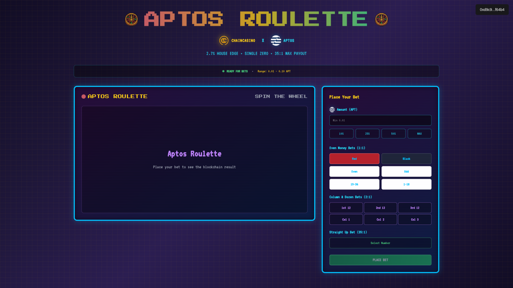

# ChainCasino

> **只有通过 Aptos 区块链技术才能实现的新资产类别。**
> **可组合、模块化链上赌场，代币持有者充当庄家，通过可验证的统计优势赚取收益，支持独立游戏、去中心化金融池集成和无限第三方扩展。**

## 🎯 项目概览

ChainCasino 展示了一种全新的金融产品架构：基于净资产价值的同质化资产，由自主资金库系统支持，该系统聚合并重新分配来自任何创收活动的现金流。

核心创新是 ChainCasino 投资者代币 (CCIT) - 一种可编程金融工具，随着底层资金库从多个收入流增长而自动升值。虽然游戏作为第一个实现，但同样的资金库-代币架构可以应用于保险风险池、房地产、内容平台、SaaS 业务或任何经济活动。

与传统的股息分配或质押奖励不同，投资者通过基于聚合资金库表现的实时代币价值升值获益。随着收入来源在整个生态系统中产生利润，资金库余额增加，直接提高所有持有者的每股净资产价值。

这创造了一种新的资产类别：多元化收入流的流动所有权权益，具有即时赎回和透明、算法价值计算 - 在传统金融中不可能实现，但通过 Aptos 区块链的速度和 Move 2 的安全保障得以实现。

## 🏗️ 技术实现

ChainCasino 是基于 **Aptos** 区块链的去中心化赌场协议，通过复杂的资金库管理系统将赌场游戏与去中心化金融投资相结合。

- 💰 **投资者代币 (CCIT):** 基于净资产价值的同质化资产，随着资金库增长而升值
- 🏦 **动态资金库:** 中央资金库与游戏资金库之间的自动路由
- 🎲 **可组合与模块化游戏:** 通过基于能力授权即插即用到赌场生态系统的独立智能合约
- 🔐 **安全至上:** 采用 Move 2 的安全保障和 Aptos 随机性

---

ChainCasino 将 **"庄家必胜"** 转化为 **"投资者必赚"**


---

## 🎮 平台概览

### 投资者门户
CCIT代币管理和投资组合跟踪的完整仪表板 - 核心投资平台。


### 游戏中心
玩家发现和访问所有已注册游戏的中央枢纽。


---

## 📐 架构概览

### 核心系统流程


### 资金库架构与自动再平衡


### Block-STM 并行执行


### 资金库自动再平衡系统

该协议实现了基于滚动交易量计算和可配置阈值的复杂资金库管理和自动再平衡功能。

**关键指标:**
- **目标储备:** 7天滚动交易量 × 1.5
- **溢出阈值:** 目标 × 110%（触发超额转移到中央）
- **枯竭阈值:** 目标 × 25%（触发从中央注入流动性）

**关键洞察:** 
- 不同的资金库地址 = 无资源冲突 = 真正的并行执行
- 动态再平衡维持最优流动性分配
- 滚动交易量计算适应实际游戏活动

---

## 🏗️ 系统组件

### 1. 赌场大厅 (核心注册与资金库管理)
通过基于能力的授权系统管理游戏注册的中央协调模块。具有中央资金库和游戏资金库之间的动态资金库路由功能，基于交易量和流动性阈值进行自动再平衡。

### 2. 投资者代币 (CCIT 同质化资产)
基于净资产价值的代币系统，投资者通过资金库增长获得收益。实现按比例铸造/销毁，赎回费用为0.1%。实时NAV计算汇总整个系统的所有资金库余额。

### 3. 游戏模块
- **七点出**: 双骰子大小于7的游戏，1.933x赔付，2.78%庄家优势
- **Aptos轮盘**: 欧洲轮盘，全面投注选项，2.70%庄家优势
- **Aptos财富**: 高端老虎机，部分匹配赔付，22%庄家优势

### 4. 外部游戏支持
模块化架构使外部开发者能够在独立包中创建游戏，同时通过基于能力的授权保持共享资金库访问。

### 5. 前端应用
完整的基于React的用户界面，包括：
- 用于CCIT代币管理的投资者门户
- 用于游戏发现的游戏中心
- 个人游戏界面
- 实时投资组合追踪
- 钱包集成

---

## 💻 技术栈

### 区块链层
- **Move 2** - 具有增强安全功能的智能合约语言
- **Aptos 区块链** - 具有Block-STM并行执行的高性能一层区块链
- **Aptos 随机性** - 游戏安全链上随机性
- **Aptos SDK** - 区块链交互的TypeScript集成

### 前端技术栈
- **React 18** - 具有钩子和并发功能的现代UI库
- **TypeScript** - 类型安全开发和增强开发者体验
- **Vite** - 闪电般快速的构建工具和开发服务器
- **Tailwind CSS** - 实用优先的CSS框架，用于快速样式设计

### 钱包集成
- **Aptos 钱包适配器** - 多钱包支持 (Petra, Martian, Pontem)
- **Wallet Connect** - 跨平台钱包连接协议

### 部署与基础设施
- **Nginx** - Web服务器和反向代理
- **Aptos CLI** - 智能合约部署和管理
- **Docker** - 容器化确保一致部署

---

## 🔧 技术实现

### 安全模型
- **基于能力的授权**: 不可伪造的游戏注册代币
- **随机性安全**: 生产函数使用具有`entry`可见性的`#[randomness]`
- **资源安全**: 显式处理所有同质化资产和代币
- **线性类型系统**: 防止资源重复并确保适当的生命周期管理

### 性能优化
- **Block-STM兼容性**: 隔离的资源地址实现真正的并行执行
- **Gas效率**: 预计算常数和优化的数据结构
- **资金库隔离**: 分布式架构随活跃游戏数量扩展

### 错误处理
- **全面的错误代码**: 所有失败场景的详细中止代码
- **优雅降级**: 系统在单个游戏失败时继续运行
- **财务安全**: 资金库验证防止资金过度承诺

---

## 🔧 模块结构

```
sources/
├── casino/
│   ├── casino_house.move       # 核心注册和资金库管理
│   └── investor_token.move     # CCIT同质化资产实现
└── games/
    ├── dice.move               # [仅测试] 参考骰子实现
    ├── slot.move               # [仅测试] 参考老虎机实现
    └── always_lose_game.move   # [仅测试] 资金库枯竭测试

game-contracts/
├── SevenOut/                   # 双骰子大小于7游戏
│   ├── sources/seven_out.move
│   └── tests/seven_out_tests.move
├── AptosRoulette/              # 欧洲轮盘实现
│   ├── sources/aptos_roulette.move
│   └── tests/roulette_integration_tests.move
└── AptosFortune/               # 高端老虎机
    ├── sources/aptos_fortune.move
    └── tests/aptos_fortune_tests.move

frontend/
└── ccit-investor-portal/       # React前端应用
    ├── frontend/
    │   ├── components/games/   # 个人游戏UI
    │   ├── pages/              # 主门户页面
    │   └── App.tsx
    ├── package.json
    └── vite.config.ts
```

---

---

## 📊 经济学

### 庄家优势与回报
- **七点出**: 2.78%庄家优势（大小于7，1.933x赔付）
- **Aptos轮盘**: 2.70%庄家优势（欧洲单零轮盘）
- **Aptos财富**: 22%庄家优势（高频胜利与部分匹配）
- **投资者回报**: CCIT通过资金库累积利润的NAV增长而升值

### 资金库机制
- **NAV计算**: `NAV = 总资金库余额 / 总代币供应量`
- **铸造**: 按当前NAV发行新代币
- **赎回**: 按当前NAV销毁代币（0.1%费用）
- **自动再平衡**: 维持最优流动性分配

---

## 🖥️ 前端开发

### 组件

#### InvestorPortal
CCIT管理的主仪表板，具有实时投资组合跟踪和资金库洞察功能。


#### GameHub
游戏发现和导航界面，显示所有已注册游戏及其统计信息。


#### SevenOut
双骰子大小7游戏，具有简单的投注界面和实时结果。


#### AptosRoulette
欧洲轮盘，具有全面的投注选项和动画轮盘。




#### AptosFortune
高级老虎机，具有部分匹配支付和详细支付表。


---

## 🧪 测试

代码库包含多层次的全面测试：

- **单元测试**: 模块特定功能
- **集成测试**: 跨模块交互
- **端到端测试**: 完整用户流程
- **资金库机制**: 再平衡和流动性管理

```bash
# 运行所有测试
aptos move test

# 运行特定测试类别
aptos move test --filter integration
aptos move test --filter end_to_end
```

---

## 📄 许可证

MIT 许可证 - 详见 LICENSE 文件。

---

*基于 Aptos 区块链构建，使用 Move 2* 