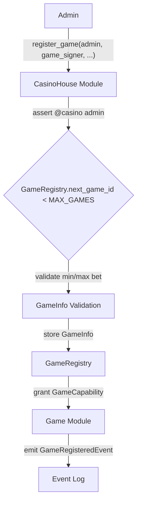
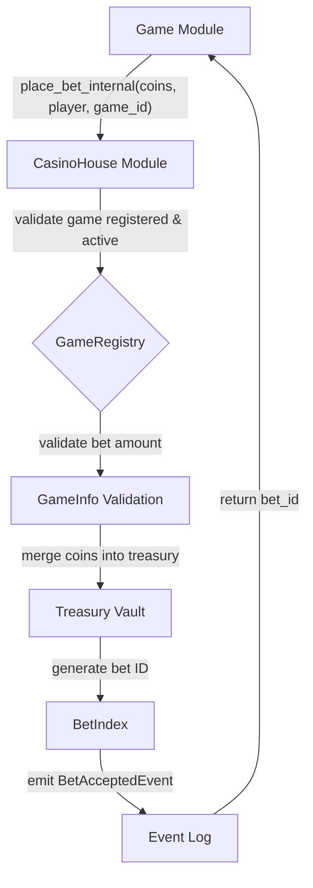
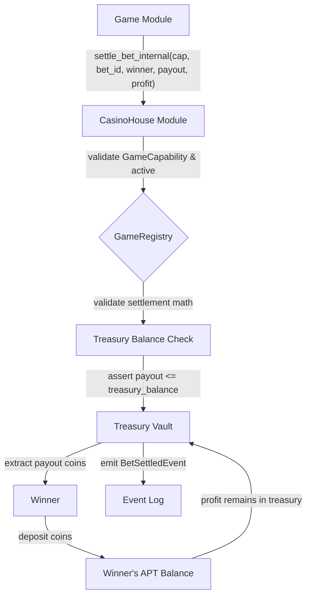

# CasinoHouse Smart Contract Specifications

## 1. Overview

This document outlines the specifications for the `CasinoHouse` smart contract, implemented in Move for the Aptos blockchain. This module serves as the central hub for game authorization, bet settlement, and treasury operations within the ChainCasino platform. It integrates with the `InvestorToken` module for profit distribution to token holders.

## 2. Module Details

*   **Module Name:** `casino::CasinoHouse`
*   **Purpose:** Manages casino treasury, game registry, bet acceptance, and settlement.

## 3. Error Codes

The following error codes are defined within the contract:

*   `E_NOT_ADMIN (0x01)`: Only casino admin can perform this operation.
*   `E_INVALID_AMOUNT (0x02)`: Invalid amount (zero or exceeds limits).
*   `E_GAME_NOT_REGISTERED (0x03)`: Game not registered or inactive.
*   `E_INVALID_GAME_INTERFACE (0x04)`: Invalid game interface implementation.
*   `E_GAME_ALREADY_REGISTERED (0x05)`: Game already registered.
*   `E_INSUFFICIENT_TREASURY (0x06)`: Insufficient treasury balance for payout.
*   `E_INVALID_SETTLEMENT (0x07)`: Invalid bet settlement parameters.
*   `E_MISSING_CAPABILITY (0x08)`: Game capability missing or invalid.

## 4. Constants

The contract utilizes the following constants:

*   `DEFAULT_HOUSE_EDGE_BPS (150)`: Default house edge of 1.5% (150 basis points).
*   `MAX_GAMES (255)`: Maximum number of games supported by the registry.

## 5. Resources (Structs)

### 5.1. `Treasury`

*   **Purpose:** Central treasury holding all casino funds.
*   **Fields:**
    *   `vault`: `Coin<AptosCoin>` - A vault holding AptosCoin.

### 5.2. `GameRegistry`

*   **Purpose:** Registry of authorized casino games.
*   **Fields:**
    *   `registered_games`: `OrderedMap<u8, GameInfo>` - A map storing registered games by their ID.
    *   `next_game_id`: `u8` - The next available game ID.

### 5.3. `BetIndex`

*   **Purpose:** Auto-incrementing bet identifier.
*   **Fields:**
    *   `next`: `u64` - The next available bet ID.

### 5.4. `Params`

*   **Purpose:** Casino operational parameters.
*   **Fields:**
    *   `house_edge_bps`: `u64` - The current house edge in basis points.

### 5.5. `GameCapability`

*   **Purpose:** Game authorization capability.
*   **Fields:**
    *   `game_id`: `u8` - The ID of the game this capability is for.

### 5.6. `GameInfo`

*   **Purpose:** Game metadata and configuration.
*   **Fields:**
    *   `name`: `String` - The name of the game.
    *   `module_address`: `address` - The address of the game module.
    *   `min_bet`: `u64` - Minimum allowed bet for the game.
    *   `max_bet`: `u64` - Maximum allowed bet for the game.
    *   `house_edge_bps`: `u64` - The house edge for this specific game.
    *   `active`: `bool` - Indicates if the game is active.

## 6. Events

### 6.1. `BetAcceptedEvent`

*   **Purpose:** Emitted when a bet is accepted by the casino.
*   **Fields:**
    *   `bet_id`: `u64` - Unique identifier for the bet.
    *   `game_id`: `u8` - ID of the game the bet was placed on.
    *   `player`: `address` - Address of the player who placed the bet.
    *   `amount`: `u64` - Amount of the bet.

### 6.2. `BetSettledEvent`

*   **Purpose:** Emitted when a bet is settled with a payout.
*   **Fields:**
    *   `bet_id`: `u64` - Unique identifier for the bet.
    *   `winner`: `address` - Address of the winner.
    *   `payout`: `u64` - Amount paid out to the winner.
    *   `profit`: `u64` - Profit generated for the casino.

### 6.3. `GameRegisteredEvent`

*   **Purpose:** Emitted when a new game is registered.
*   **Fields:**
    *   `game_id`: `u8` - ID of the registered game.
    *   `name`: `String` - Name of the registered game.
    *   `module_address`: `address` - Module address of the registered game.

### 6.4. `GameUnregisteredEvent`

*   **Purpose:** Emitted when a game is unregistered.
*   **Fields:**
    *   `game_id`: `u8` - ID of the unregistered game.
    *   `name`: `String` - Name of the unregistered game.

### 6.5. `GameToggleEvent`

*   **Purpose:** Emitted when a game's active status changes.
*   **Fields:**
    *   `game_id`: `u8` - ID of the game.
    *   `active`: `bool` - New active status of the game.

## 7. Initialization Interface

### 7.1. `init(owner: &signer)`

*   **Function Type:** `public entry fun`
*   **Description:** Initializes the CasinoHouse with treasury, game registry, bet index, and parameters.
*   **Actions:**
    *   Asserts that the caller is the `@casino` address.
    *   Initializes `Treasury` with an empty `AptosCoin` vault.
    *   Initializes `GameRegistry` with an empty map and `next_game_id` set to 1.
    *   Initializes `BetIndex` with `next` set to 1.
    *   Initializes `Params` with `house_edge_bps` set to `DEFAULT_HOUSE_EDGE_BPS`.

## 8. Game Management Interface

### 8.1. `register_game(admin: &signer, game_signer: &signer, name: vector<u8>, min_bet: u64, max_bet: u64, house_edge_bps: u64)`

*   **Function Type:** `public entry fun`
*   **Description:** Registers a new game and grants it a `GameCapability`.
*   **Parameters:**
    *   `admin`: `&signer` - The signer of the casino admin.
    *   `game_signer`: `&signer` - The signer of the game module.
    *   `name`: `vector<u8>` - The name of the game.
    *   `min_bet`: `u64` - Minimum allowed bet for the game.
    *   `max_bet`: `u64` - Maximum allowed bet for the game.
    *   `house_edge_bps`: `u64` - House edge for this specific game.
*   **Actions:**
    *   Asserts that the caller is the `@casino` admin.
    *   Asserts that `next_game_id` is less than `MAX_GAMES`.
    *   Assigns a new `game_id` and increments `next_game_id`.
    *   Validates `min_bet` and `max_bet`.
    *   Stores `GameInfo` in `GameRegistry`.
    *   Grants `GameCapability` to the `game_signer`.
    *   Emits a `GameRegisteredEvent`.

### 8.2. `unregister_game(admin: &signer, game_id: u8)`

*   **Function Type:** `public entry fun`
*   **Description:** Permanently removes a game from the registry.
*   **Parameters:**
    *   `admin`: `&signer` - The signer of the casino admin.
    *   `game_id`: `u8` - The ID of the game to unregister.
*   **Actions:**
    *   Asserts that the caller is the `@casino` admin.
    *   Asserts that the game is registered.
    *   Removes the game from `GameRegistry`.
    *   Emits a `GameUnregisteredEvent`.

### 8.3. `toggle_game(admin: &signer, game_id: u8, active: bool)`

*   **Function Type:** `public entry fun`
*   **Description:** Toggles the active status of a registered game.
*   **Parameters:**
    *   `admin`: `&signer` - The signer of the casino admin.
    *   `game_id`: `u8` - The ID of the game.
    *   `active`: `bool` - The new active status.
*   **Actions:**
    *   Asserts that the caller is the `@casino` admin.
    *   Asserts that the game is registered.
    *   Updates the `active` status in `GameInfo`.
    *   Emits a `GameToggleEvent`.

## 9. Bet Flow Interface (Friend Functions)

These functions are designed to be called by authorized game modules (friends of `CasinoHouse`).

### 9.1. `place_bet_internal(coins: Coin<AptosCoin>, player: address, game_id: u8): u64`

*   **Function Type:** `public(friend) fun`
*   **Description:** Accepts a bet from an authorized game.
*   **Parameters:**
    *   `coins`: `Coin<AptosCoin>` - The coins representing the bet amount.
    *   `player`: `address` - The address of the player placing the bet.
    *   `game_id`: `u8` - The ID of the game.
*   **Returns:** `u64` - The generated `bet_id`.
*   **Actions:**
    *   Validates that the game is registered and active.
    *   Validates that the bet `amount` is within the game's `min_bet` and `max_bet`.
    *   Merges the bet `coins` into the `Treasury` vault.
    *   Generates a new `bet_id` and increments `next` in `BetIndex`.
    *   Emits a `BetAcceptedEvent`.

### 9.2. `settle_bet_internal(cap: &GameCapability, bet_id: u64, winner: address, payout: u64, profit: u64)`

*   **Function Type:** `public(friend) fun`
*   **Description:** Settles a bet with a payout from the treasury.
*   **Parameters:**
    *   `cap`: `&GameCapability` - The game's authorization capability.
    *   `bet_id`: `u64` - The ID of the bet being settled.
    *   `winner`: `address` - The address of the winner.
    *   `payout`: `u64` - The amount to pay out to the winner.
    *   `profit`: `u64` - The profit generated for the casino (remains in treasury).
*   **Actions:**
    *   Validates the `GameCapability` and game's active status.
    *   Validates settlement math (`payout + profit` should equal the original bet amount).
    *   Asserts that `payout` is less than or equal to the `treasury_balance`.
    *   If `payout` is greater than 0, extracts `payout` coins from `Treasury` and deposits to `winner`.
    *   Emits a `BetSettledEvent`.

### 9.3. `redeem_from_treasury(amount: u64): Coin<AptosCoin>`

*   **Function Type:** `public(friend) fun`
*   **Description:** Extracts funds from the treasury for `InvestorToken` redemptions.
*   **Parameters:**
    *   `amount`: `u64` - The amount to redeem.
*   **Returns:** `Coin<AptosCoin>` - The extracted coins.
*   **Actions:**
    *   Asserts that `amount` is less than or equal to the `treasury_balance`.
    *   Extracts `amount` coins from the `Treasury` vault.

### 9.4. `deposit_to_treasury(coins: Coin<AptosCoin>)`

*   **Function Type:** `public(friend) fun`
*   **Description:** Deposits coins to the treasury (primarily for `InvestorToken` deposits).
*   **Parameters:**
    *   `coins`: `Coin<AptosCoin>` - The coins to deposit.
*   **Actions:**
    *   Merges the `coins` into the `Treasury` vault.

## 10. View Interface

### 10.1. `get_registered_games(): vector<GameInfo>`

*   **Function Type:** `public view fun`
*   **Description:** Returns a vector of all registered games.
*   **Returns:** `vector<GameInfo>` - A list of `GameInfo` structs for all registered games.

### 10.2. `get_game_info(game_id: u8): GameInfo`

*   **Function Type:** `public view fun`
*   **Description:** Returns information for a specific game.
*   **Parameters:**
    *   `game_id`: `u8` - The ID of the game.
*   **Returns:** `GameInfo` - The `GameInfo` struct for the specified game.
*   **Actions:**
    *   Asserts that the game is registered.

### 10.3. `get_params(): u64`

*   **Function Type:** `public view fun`
*   **Description:** Returns the casino's operational parameters (currently only house edge).
*   **Returns:** `u64` - The `house_edge_bps`.

### 10.4. `treasury_balance(): u64`

*   **Function Type:** `public view fun`
*   **Description:** Returns the current balance of APT in the casino treasury.
*   **Returns:** `u64` - The treasury's APT balance.

### 10.5. `is_game_active(game_id: u8): bool`

*   **Function Type:** `public view fun`
*   **Description:** Checks if a game is registered and active.
*   **Parameters:**
    *   `game_id`: `u8` - The ID of the game.
*   **Returns:** `bool` - `true` if the game is registered and active, `false` otherwise.

## 11. Admin Interface

### 11.1. `set_house_edge(admin: &signer, new_edge_bps: u64)`

*   **Function Type:** `public entry fun`
*   **Description:** Updates the casino's house edge.
*   **Parameters:**
    *   `admin`: `&signer` - The signer of the casino admin.
    *   `new_edge_bps`: `u64` - The new house edge in basis points.
*   **Actions:**
    *   Asserts that the caller is the `@casino` admin.
    *   Asserts that `new_edge_bps` is less than or equal to 1000 (max 10%).
    *   Updates the `house_edge_bps` in `Params`.

## 12. Contract Mechanics Visualizations

To further illustrate the core mechanics of the `CasinoHouse` contract, the following Mermaid graphs are provided.

### 12.1. Game Registration Flow

This graph visualizes the process of registering a new game with the CasinoHouse.

### 12.2. Bet Acceptance Flow

This graph illustrates the process of accepting a bet from an authorized game.

### 12.3. Bet Settlement Flow

This graph illustrates the process of settling a bet and distributing payouts.

